# Web Solution with WordPress

## LAUNCHING AN EC2 INSTANCE THAT WILL SERVE AS “WEB SERVER”

### Step 1 — Prepare a Web Server: Launch an EC2 instance that will serve as "Web Server". Create 3 volumes in the same AZ as the Web Server EC2, each of 10 GiB.

### Attaching all three volumes one by one to the Web Server EC2 instance

### Use 'lsblk' command to inspect what block devices are attached to the server. Notice names of your newly created devices. All devices in Linux reside in /dev/ directory. Inspect it with ls /dev/ and make sure you see all 3 newly created block devices there – their names will likely be xvdf, xvdh, xvdg.

`lsblk`

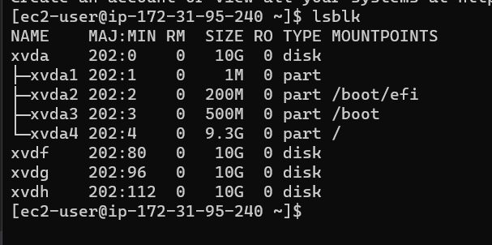

### Using df -h command to see all mounts and free space on your server

`df -h`

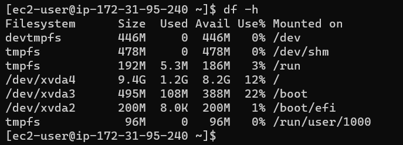

### Using the 'gdisk' utility to create a single partition on each of the 3 disks

`sudo gdisk /dev/xvdf`


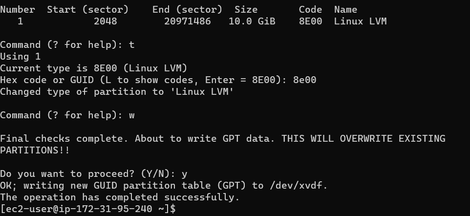

`sudo gdisk /dev/xvdg`

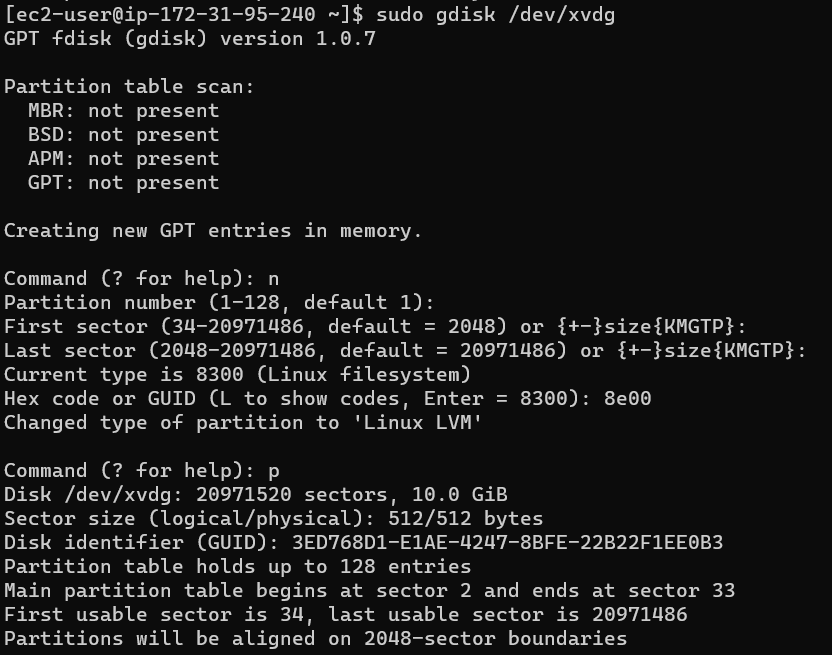

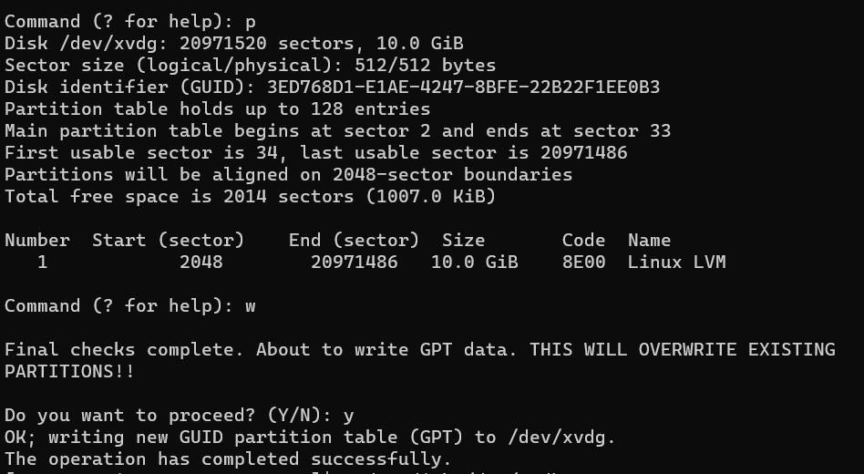

`sudo gdisk /dev/xvdh`

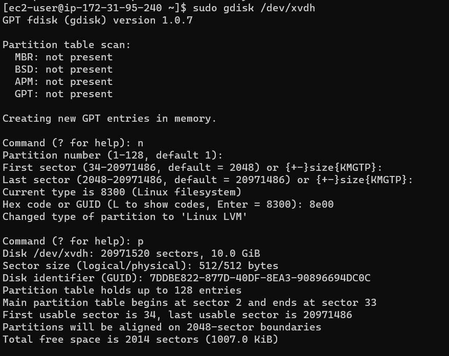

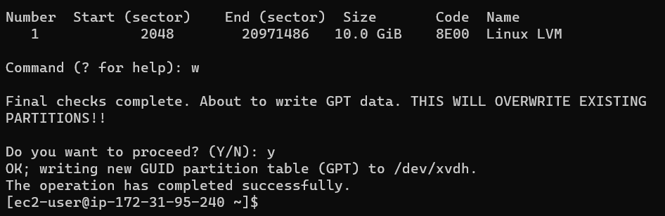

### Using the 'lsblk' utility to view the newly configured partition on each of the 3 disks.

`lsblk`

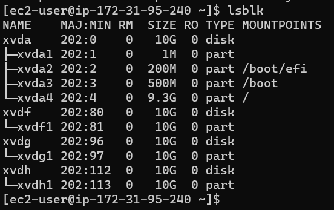

### Install lvm2 package using sudo yum install lvm2. 

`sudo yum install lvm2`

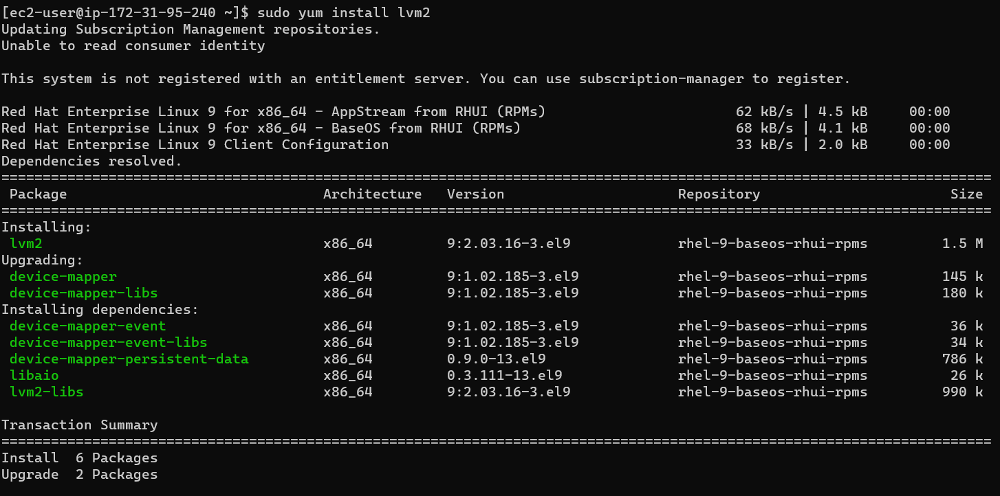

### Run sudo lvmdiskscan command to check for available partitions.

`sudo lvmdiskscan`

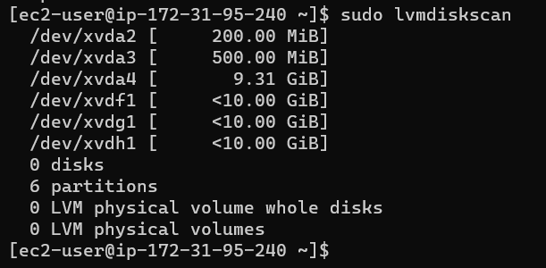

### Note: Previously, in Ubuntu we used apt command to install packages, in RedHat/CentOS a different package manager is used, so we shall use yum command instead.

### Using pvcreate utility to mark each of 3 disks as physical volumes (PVs) to be used by LVM

`sudo pvcreate /dev/xvdf1`
`sudo pvcreate /dev/xvdg1`
`sudo pvcreate /dev/xvdh1`

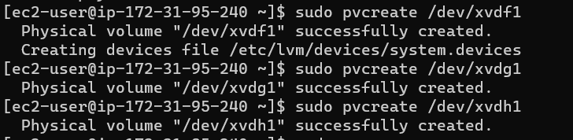

### Verifying that the Physical volumess have been created successfully by running `sudo pvs`

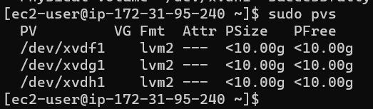

### Using vgcreate utility to add all 3 PVs to a volume group (VG). Name the VG webdata-vg

`sudo vgcreate webdata-vg /dev/xvdh1 /dev/xvdg1 /dev/xvdf1`

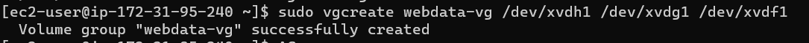
### Verify that your VG has been created successfully by running `sudo vgs`

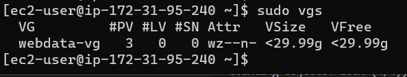

### Using `lvcreate` utility to create 2 logical volumes. apps-lv (Use half of the PV size), and logs-lv Use the remaining space of the PV size. NOTE: apps-lv will be used to store data for the Website while, logs-lv will be used to store data for logs.

`sudo lvcreate -n apps-lv -L 14G webdata-vg`
`sudo lvcreate -n logs-lv -L 14G webdata-vg`

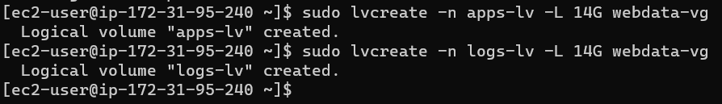

### Verify that your Logical Volume has been created successfully by running `sudo lvs`

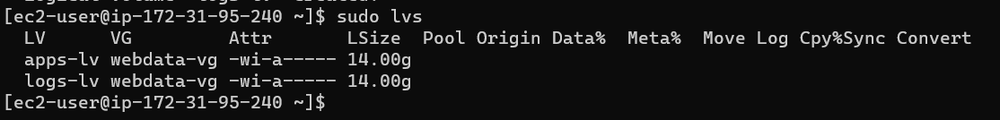

### Verifying the entire setup

`sudo vgdisplay -v #view complete setup - VG, PV, and LV`

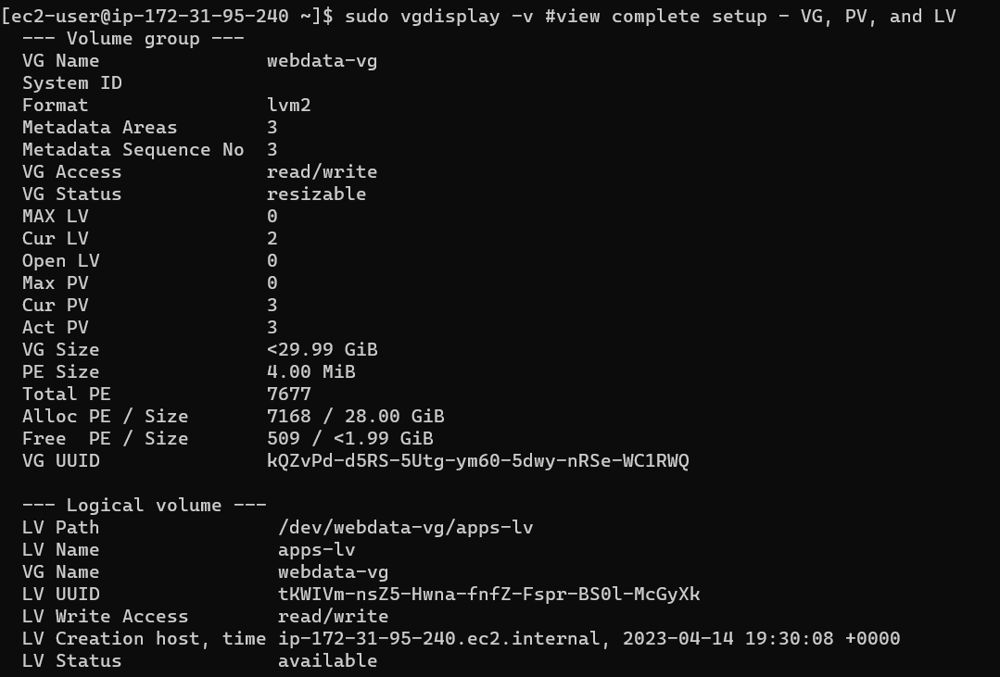

`sudo lsblk`

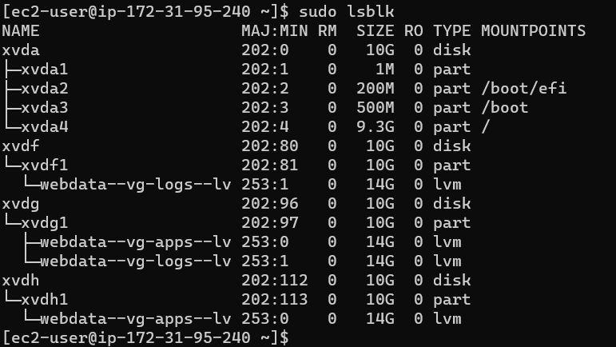

### Using `mkfs.ext4` to format the logical volumes with ext4 filesystem

`sudo mkfs -t ext4 /dev/webdata-vg/apps-lv`
`sudo mkfs -t ext4 /dev/webdata-vg/logs-lv`

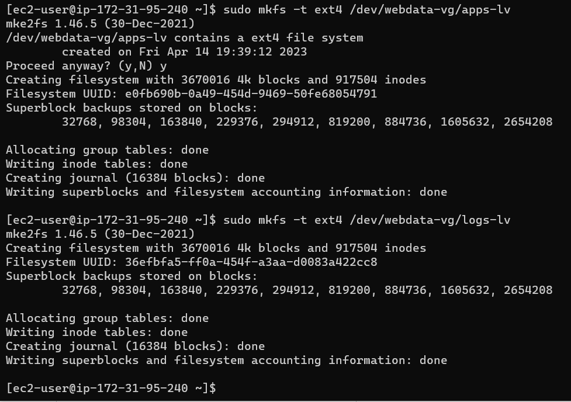

### Creating /var/www/html directory to store website files

`sudo mkdir -p /var/www/html`

### Creating /home/recovery/logs to store backup of log data

`sudo mkdir -p /home/recovery/logs`

### Mount /var/www/html on apps-lv logical volume

`sudo mount /dev/webdata-vg/apps-lv /var/www/html/`

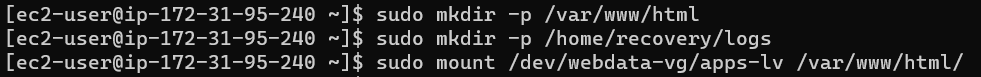

### Use rsync utility to backup all the files in the log directory /var/log into /home/recovery/logs (This is required before mounting the file system)

`sudo rsync -av /var/log/. /home/recovery/logs/`

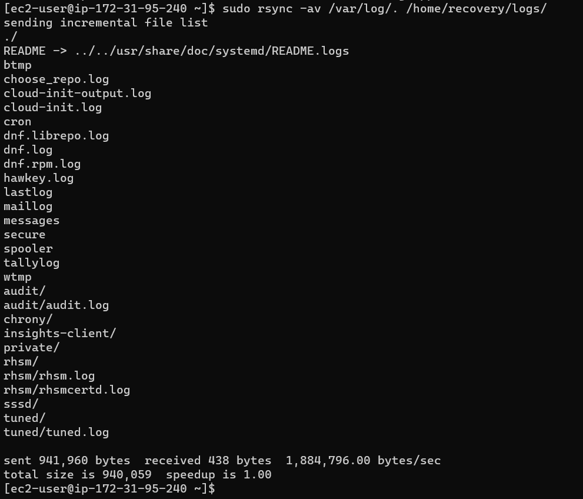

### Mount /var/log on logs-lv logical volume. (Note that all the existing data on /var/log will be deleted. That is why step above is very important)

`sudo mount /dev/webdata-vg/logs-lv /var/log`

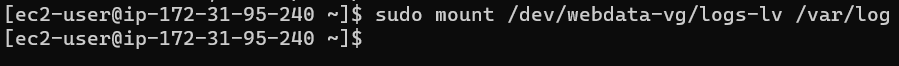

### Restore log files back into /var/log directory

`sudo rsync -av /home/recovery/logs/. /var/log`

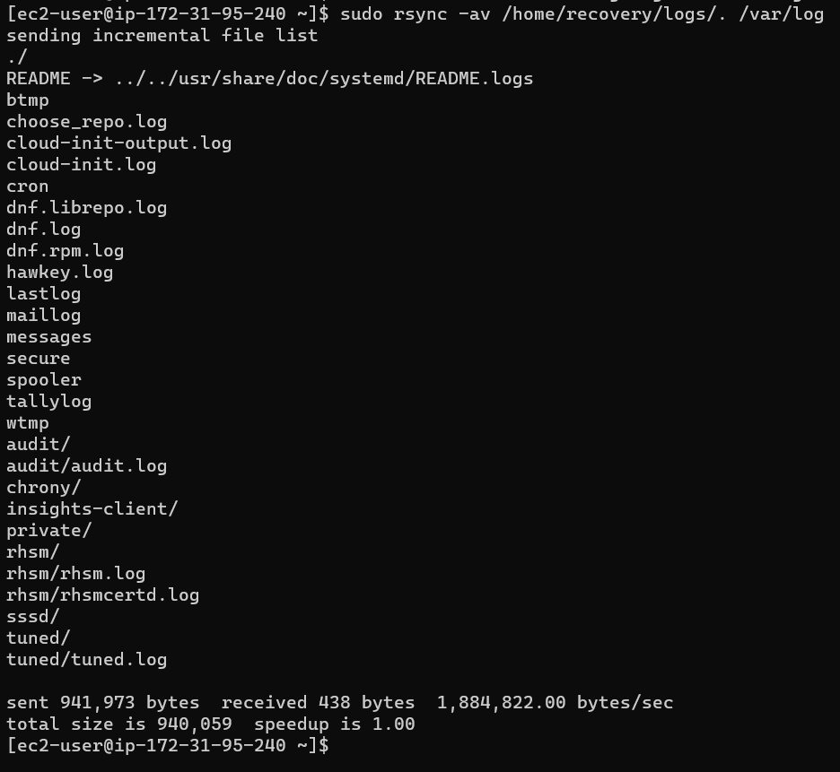

### Updating /etc/fstab file so that the mount configuration will persist after restart of the server.

## UPDATE THE `/ETC/FSTAB` FILE

### The UUID of the device will be used to update the /etc/fstab file;

`sudo blkid`

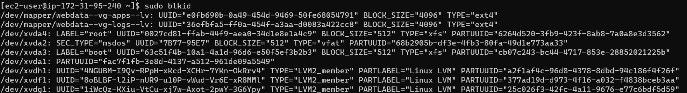

`sudo vi /etc/fstab`

### Updating /etc/fstab in this format using my own UUID, without the leading and ending quotes.

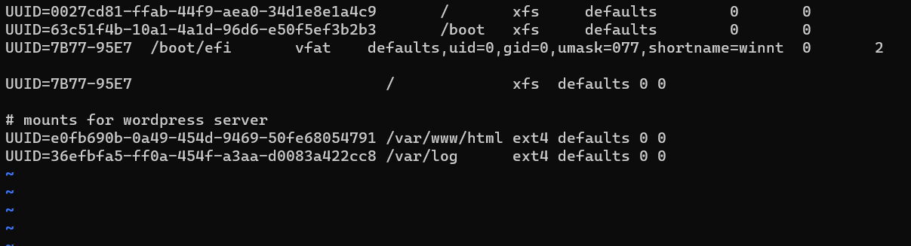

### Test the configuration and reload the daemon

`sudo mount -a`
`sudo systemctl daemon-reload`

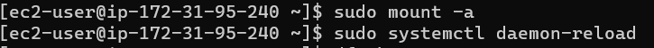
### Verifying the setup by running `df -h`,

`df -h`

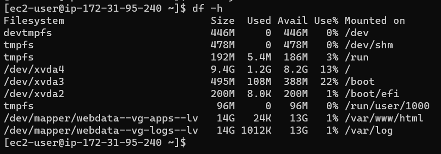

## Step 2 — Prepare the Database Server

### Launching a second RedHat EC2 instance that will have a role – ‘DB Server’
### Repeating the same steps as for the Web Server, but instead of apps-lv, we create db-lv and mount it to /db directory instead of /var/www/html/.

## STEPS REPEATED ON THE DB SERVER AS DESCRIBED ABOVE
### Use `lsblk` command to inspect what block devices are attached to the server. Notice names of your newly created devices. All devices in Linux reside in /dev/ directory. Inspect it with ls /dev/ and make sure you see all 3 newly created block devices there – their names will likely be xvdf, xvdh, xvdg.

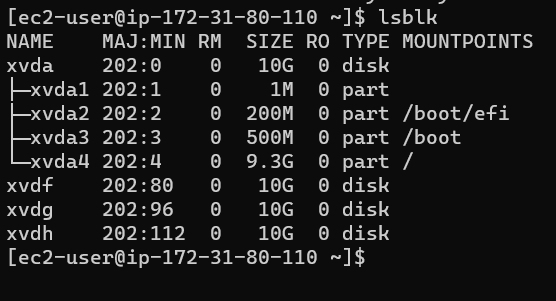

### Using `df -h` command to see all mounts and free space on your server

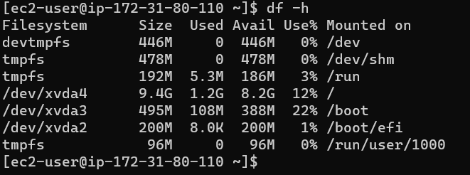

### Use `gdisk` utility to create a single partition on each of the 3 disks

`sudo gdisk /dev/xvdf`
`sudo gdisk /dev/xvdg`
`sudo gdisk /dev/xvdh`

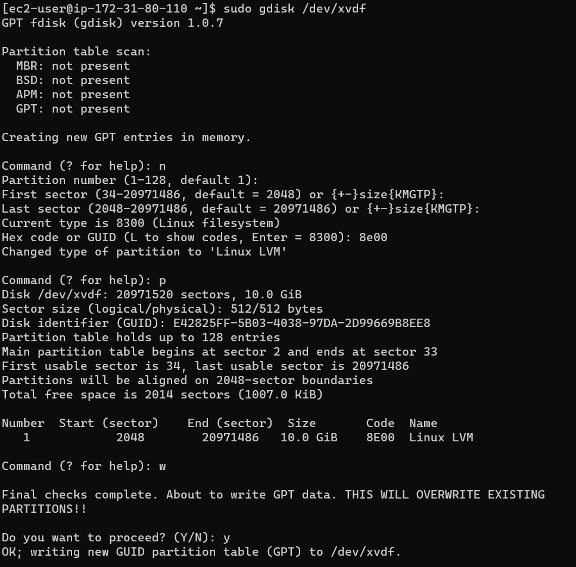
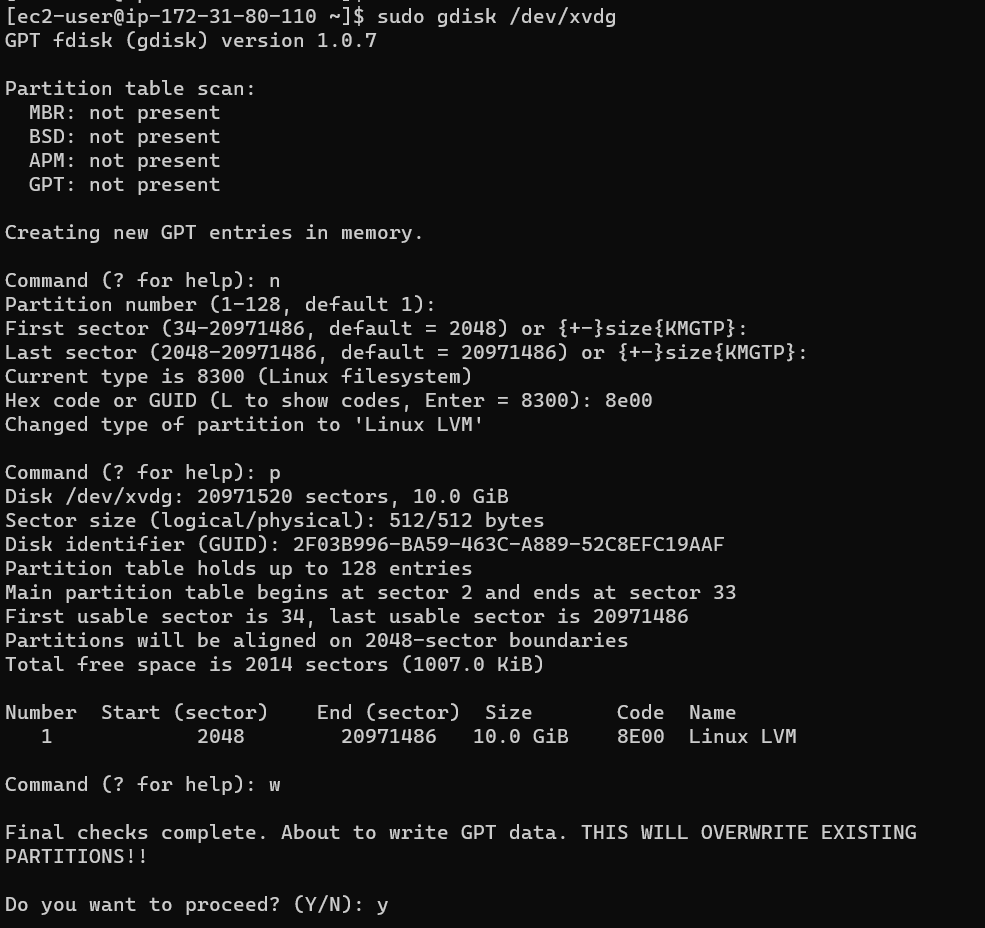
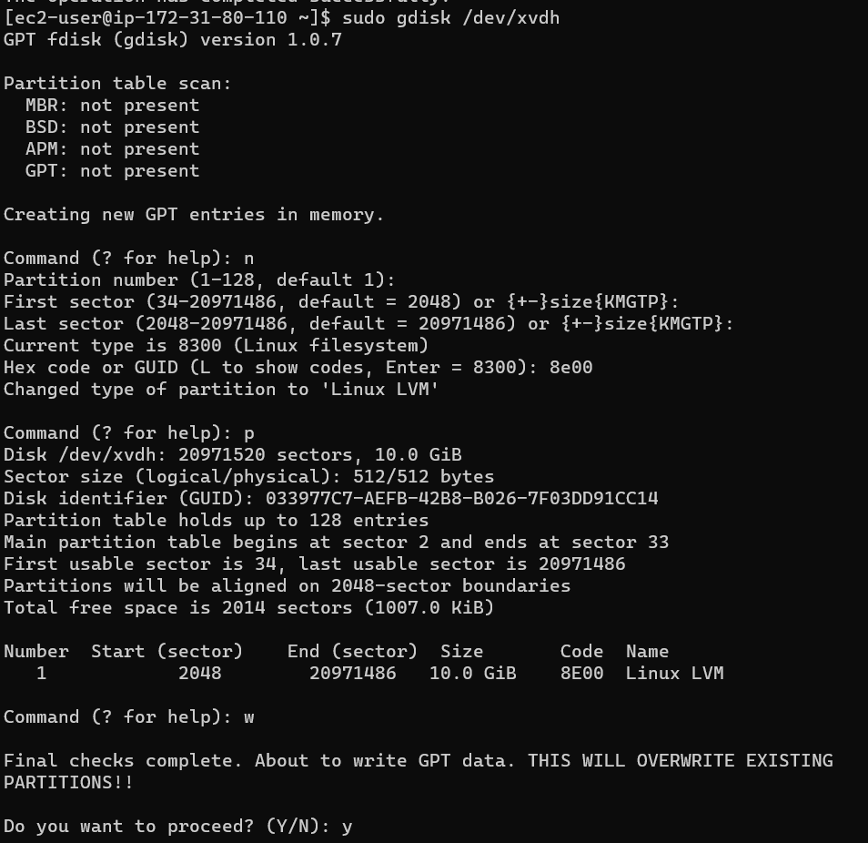

### Use `lsblk` utility to view the newly configured partition on each of the 3 disks.

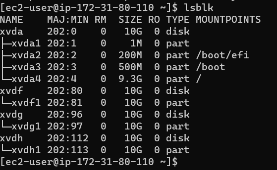

### Installing lvm2 package using `sudo yum install lvm2`. Run `sudo lvmdiskscan` command to check for available partitions.

`sudo yum install lvm2`

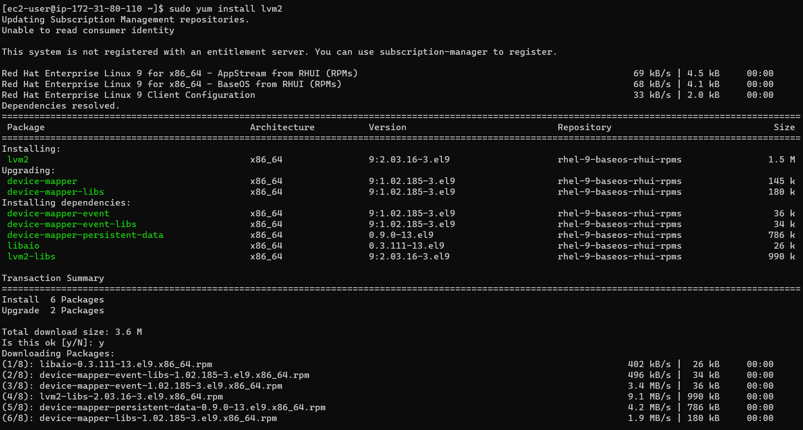

`sudo lvmdiskscan`

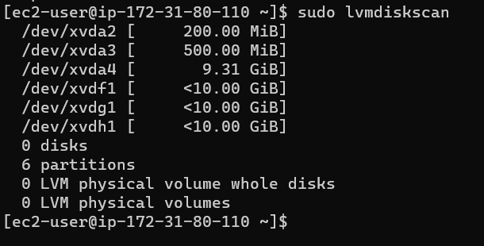

### Using pvcreate utility to mark each of 3 disks as physical volumes (PVs) to be used by LVM

`sudo pvcreate /dev/xvdf1`
`sudo pvcreate /dev/xvdg1`
`sudo pvcreate /dev/xvdh1`

### Verify that your Physical volume has been created successfully by running `sudo pvs`

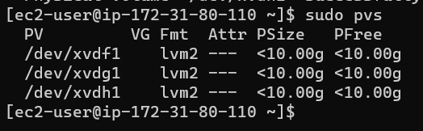

### Use vgcreate utility to add all 3 PVs to a volume group (VG). Name the VG webdata-vg

`sudo vgcreate webdata-vg /dev/xvdh1 /dev/xvdg1 /dev/xvdf1`

### Verify that your VG has been created successfully by running `sudo vgs`

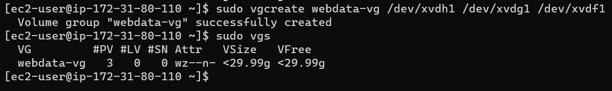

### Using lvcreate utility to create 2 logical volumes. db-lv (Use half of the PV size), and logs-lv Use the remaining space of the PV size. NOTE: db-lv will be used to store data for the database while, logs-lv will be used to store data for logs.

`sudo lvcreate -n db-lv -L 14G webdata-vg`
`sudo lvcreate -n logs-lv -L 14G webdata-vg`

### Verify that your Logical Volume has been created successfully by running `sudo lvs`

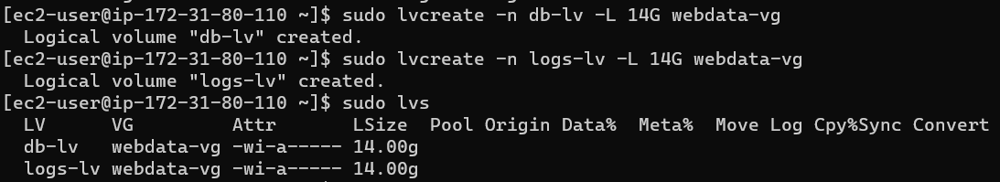

### Verifying the entire setup:

`sudo vgdisplay -v #view complete setup - VG, PV, and LV`

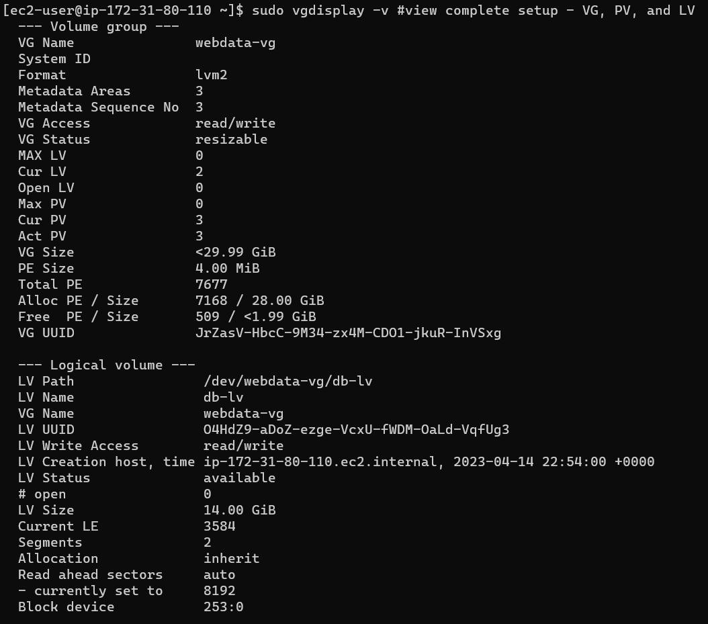

`sudo lsblk`

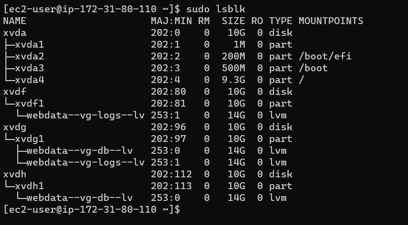

### Using mkfs.ext4 to format the logical volumes with ext4 filesystem

`sudo mkfs -t ext4 /dev/webdata-vg/db-lv`
`sudo mkfs -t ext4 /dev/webdata-vg/logs-lv`

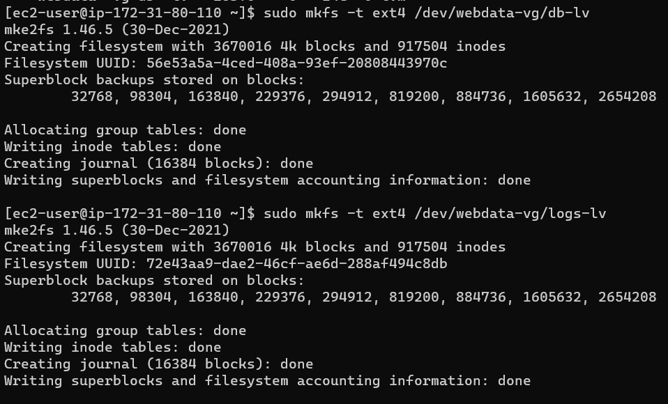

### Creating /db directory to store db files

`sudo mkdir -p /db`

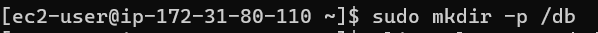

### Creating /home/recovery/logs to store backup of log data

`sudo mkdir -p /home/recovery/logs`


### Mount /db on db-lv logical volume

`sudo mount /dev/webdata-vg/db-lv /db`

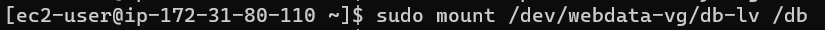

### Use rsync utility to backup all the files in the log directory /var/log into /home/recovery/logs (This is required before mounting the file system)

`sudo rsync -av /var/log/. /home/recovery/logs/`

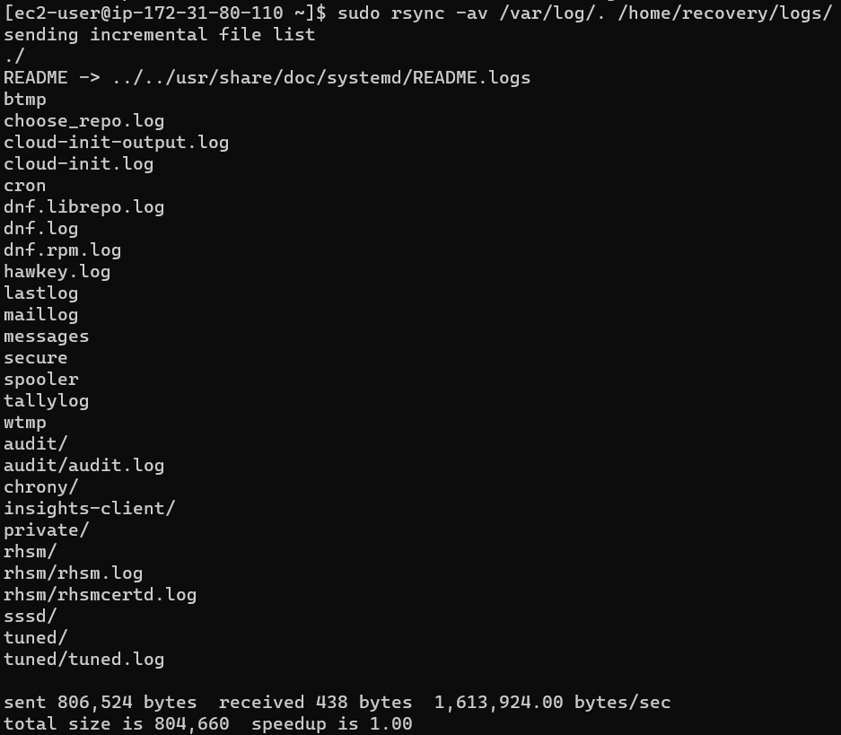

### Mount /var/log on logs-lv logical volume. (Note that all the existing data on /var/log will be deleted)

`sudo mount /dev/webdata-vg/logs-lv /var/log`

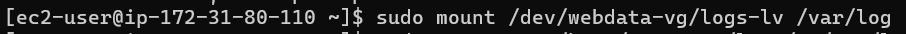

### Restore log files back into /var/log directory

`sudo rsync -av /home/recovery/logs/. /var/log`

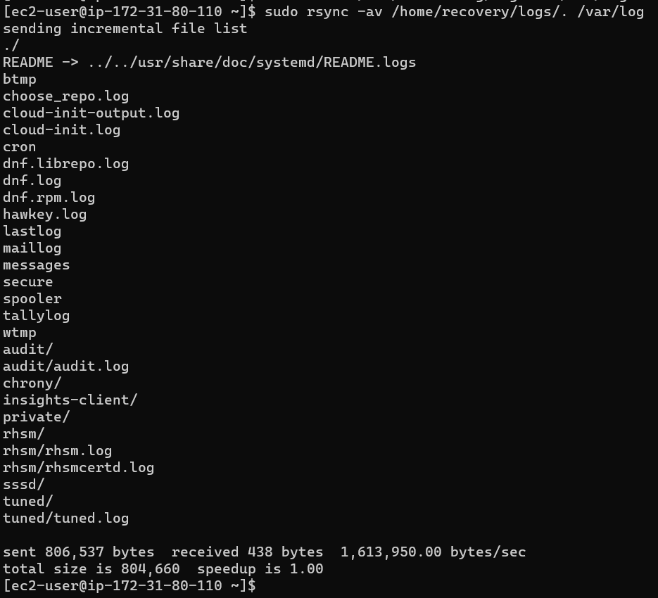

## Updating /etc/fstab file so that the mount configuration will persist after restart of the server.

## UPDATING THE `/ETC/FSTAB` FILE

### The UUID of the device will be used to update the /etc/fstab file;

`sudo blkid`

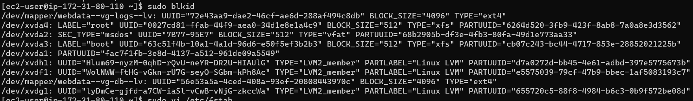

`sudo vi /etc/fstab`

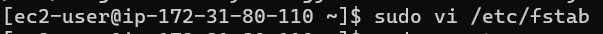

### Updating /etc/fstab in this format using my UUIDs

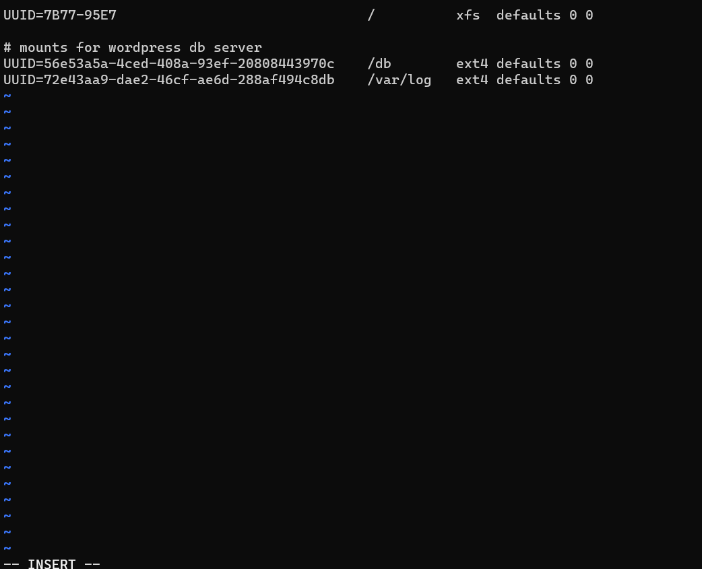

### Testing the configuration and reloading the daemon

`sudo mount -a`
`sudo systemctl daemon-reload`


### Verify your setup by running `df -h`, output must look like this:

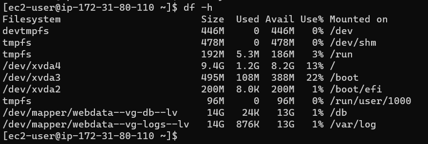

## Installing WordPress on Web Server EC2

### Updating the repository

`sudo yum -y update`


### Install wget, Apache and it’s dependencies

`sudo yum -y install wget httpd php php-mysqlnd php-fpm php-json`


### Starting Apache

`sudo systemctl enable httpd`
`sudo systemctl start httpd`


### To install PHP and it’s dependencies

```
sudo yum install https://dl.fedoraproject.org/pub/epel/epel-release-latest-8.noarch.rpm
sudo yum install yum-utils http://rpms.remirepo.net/enterprise/remi-release-8.rpm
sudo yum module list php
sudo yum module reset php
sudo yum module enable php:remi-7.4
sudo yum install php php-opcache php-gd php-curl php-mysqlnd
sudo systemctl start php-fpm
sudo systemctl enable php-fpm
sudo setsebool -P httpd_execmem 1
```

### Restart Apache

`sudo systemctl restart httpd`


### Download wordpress and copy wordpress to var/www/html

mkdir wordpress
cd   wordpress
sudo wget http://wordpress.org/latest.tar.gz
sudo tar xzvf latest.tar.gz
sudo rm -rf latest.tar.gz
cp wordpress/wp-config-sample.php wordpress/wp-config.php
cp -R wordpress /var/www/html/


### Configure SELinux Policies

```
sudo chown -R apache:apache /var/www/html/wordpress
sudo chcon -t httpd_sys_rw_content_t /var/www/html/wordpress -R
sudo setsebool -P httpd_can_network_connect=1
```


## Installing MySQL on your DB Server EC2

`sudo yum update`
`sudo yum install mysql-server`


### Verifying that the service is up and running by using `sudo systemctl status mysqld`, if it is not running, restart the service and enable it so it will be running even after reboot:

```
sudo systemctl restart mysqld
sudo systemctl enable mysqld
```


### Configure DB to work with WordPress

```
sudo mysql
CREATE DATABASE wordpress;
CREATE USER `myuser`@`<Web-Server-Private-IP-Address>` IDENTIFIED BY 'mypass';
GRANT ALL ON wordpress.* TO 'myuser'@'<Web-Server-Private-IP-Address>';
FLUSH PRIVILEGES;
SHOW DATABASES;
exit
```


### Configure WordPress to connect to remote database.

### Hint: I Will not forget to open MySQL port 3306 on DB Server EC2. For extra security, I shall allow access to the DB server ONLY from the Web Server’s IP address, so in the Inbound Rule configuration, I will specify source as /32

### Installing MySQL client and testing that I can connect from my Web Server to my DB server by using `mysql-client`

`sudo yum install mysql`


### Creating login to the database on the db server:

`sudo mysql -u admin -p -h <DB-Server-Private-IP-address>`


### Verifying that I can successfully execute `SHOW DATABASES;` command and see a list of existing databases.


### Changing permissions and configuration so Apache could use WordPress:

### Here we need to create a configuration file for wordpress in order to point client requests to the wordpress directory.

`sudo vi /etc/httpd/conf.d/wordpress.conf`

### Updating the config file with lines below:

```
<VirtualHost *:80>
ServerAdmin derick@172.31.80.110
DocumentRoot /var/www/html/wordpress

<Directory "/var/www/html/wordpress">
Options Indexes FollowSymLinks
AllowOverride all
Require all granted
</Directory>

ErrorLog /var/log/httpd/wordpress_error.log
CustomLog /var/log/httpd/wordpress_access.log common
</VirtualHost>
```

### To apply the changes, restart Apache

### Edit the wp-config file

`sudo vi /var/www/html/wordpress/wp-config.php`

### and adding the following lines:

```
define('DB_NAME', 'wordpress');
define('DB_USER', 'myuser');
define('DB_PASSWORD', 'mypass');
define('DB_HOST', '<db-Server-Private-IP-Address>');
define('DB_CHARSET', 'utf8mb4');
define('DB_COLLATE', '');
```

### Accessing from my browser the link to my WordPress site, over the internet

[WordPress](http://44.201.107.249/wp-admin)


