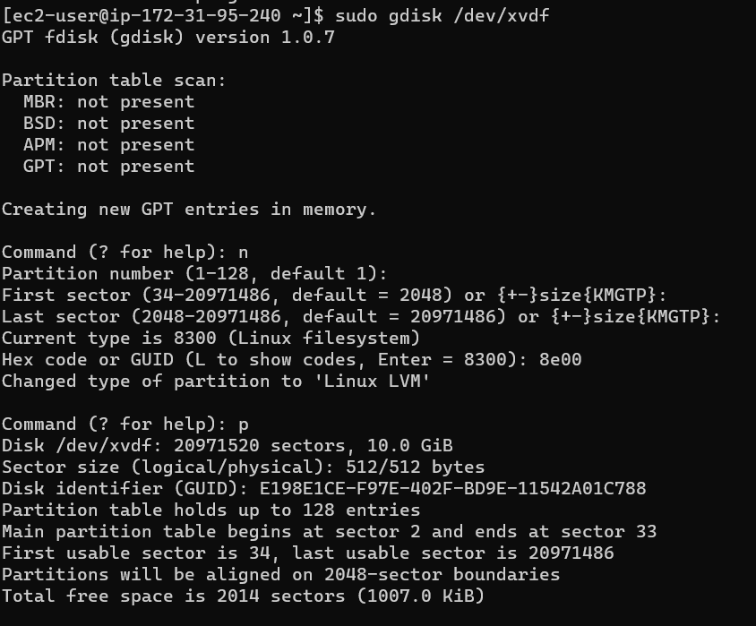

# Web Solution with WordPress

## LAUNCHING AN EC2 INSTANCE THAT WILL SERVE AS “WEB SERVER”

### Step 1 — Prepare a Web Server: Launch an EC2 instance that will serve as "Web Server". Create 3 volumes in the same AZ as the Web Server EC2, each of 10 GiB.

### Attaching all three volumes one by one to the Web Server EC2 instance

### Use 'lsblk' command to inspect what block devices are attached to the server. Notice names of your newly created devices. All devices in Linux reside in /dev/ directory. Inspect it with ls /dev/ and make sure you see all 3 newly created block devices there – their names will likely be xvdf, xvdh, xvdg.

`lsblk`

### Using df -h command to see all mounts and free space on your server

`df -h`

### Using the 'gdisk' utility to create a single partition on each of the 3 disks

`sudo gdisk /dev/xvdf`

`sudo gdisk /dev/xvdg`

`sudo gdisk /dev/xvdh`

### Using the 'lsblk' utility to view the newly configured partition on each of the 3 disks.

`lsblk`

### Install lvm2 package using sudo yum install lvm2. 

`sudo yum install lvm2`

### Run sudo lvmdiskscan command to check for available partitions.

`sudo lvmdiskscan`

### Note: Previously, in Ubuntu we used apt command to install packages, in RedHat/CentOS a different package manager is used, so we shall use yum command instead.

### Using pvcreate utility to mark each of 3 disks as physical volumes (PVs) to be used by LVM

`sudo pvcreate /dev/xvdf1`
`sudo pvcreate /dev/xvdg1`
`sudo pvcreate /dev/xvdh1`

### Verifying that the Physical volumess have been created successfully by running `sudo pvs`

### Using vgcreate utility to add all 3 PVs to a volume group (VG). Name the VG webdata-vg

`sudo vgcreate webdata-vg /dev/xvdh1 /dev/xvdg1 /dev/xvdf1`

### Verify that your VG has been created successfully by running `sudo vgs`

